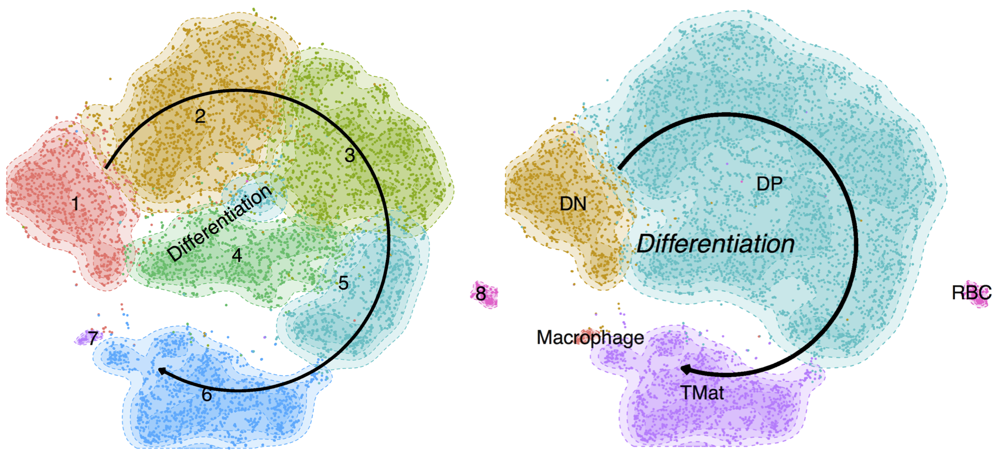

# Coup of T: Finding missing immune cell subtypes in growth restricted neonates using novel single-cell sequencing analysis #


Bacon, W.A. <sup>‡,1,2,3</sup>, Hamilton, R.S. <sup>‡,2,3</sup>, Kieckbusch, J. <sup>1,2</sup>, Yu, Z. <sup>4</sup>,  Abell, C. <sup>4</sup>, Colucci, F. <sup>1,2</sup> & Charnock-Jones, D.S. <sup>§,1,2</sup>

<sup>‡</sup> Co-first authors,
<sup>§</sup> Corresponding author <br>
<sup>1</sup> Department of Obstetrics & Gynaecology,
<sup>2</sup> Centre for Trophoblast Research,
<sup>3</sup> Department of Physiology, Development, & Neuroscience, University of Cambridge, Downing Site, Cambridge, CB2 3DY,
<sup>4</sup> Department of Chemistry

## Publication ##
Bacon, W.A., Hamilton, R.S., Kieckbusch, J., Yu, Z.,  Abell, C., Colucci, F. and Charnock-Jones, D.S. (2018) Coup of T: Finding missing immune cell subtypes in growth restricted neonates using novel single-cell sequencing analysis. <i>Submitted</i>

## Contact ##

Contact rsh46 -at- cam.ac.uk for bioinformatics related queries

## Abstract ##

To be added on paper acceptance




### Data Processing ###
All custom analysis scripts are freely available from https://github.com/CTR-BFX/2018_Bacon_Charnock-Jones including code to recreate the figures relating the single cell sequencing.

<i><b>Note:</b> The provided R scripts all assume the script is placed in a directory containing the DEMs and/or Robjects. The script can be run interactively in R-studio or as a batch using Rscript. Note that some of the figures in the manuscript have had some label positions moved manually to prevent overlaps. R package versions are listed in the table below.</i>

Raw Fastq files are demultiplexed ([dropseq_demultiplex.sh](dropseq_demultiplex.sh)) using the Nextera indices and then converted to uBAM using PicardTools:FastqToSam (v2.9.0). Quality control, alignment (STAR v020201) gene quantification and final matrix generation were performed using DropSeqTools (v1.12 http://mccarrolllab.com/dropseq/). Alignments were performed against the mouse reference genome (mm10 available from http://mccarrolllab.com/dropseq/). The resulting digital expression matrix (DEM) was imported into Seurat (Butler et al, 2018)(v2.3.0) for downstream analysis. Initial thresholds of a minimum 200 genes per cell and genes must be present in at least 3 cells were applied.

All downstream analysis is performed using Seurat and has been split into two scripts. The first, [dropseq_seurat_splitDEMs.R](dropseq_seurat_splitDEMs.R), performs the more computationally intensive tasks intended to be run on high performance computers, the Seurat object is saves in Robj format to be imported in to the, the second script, [dropseq_seurat_splitDEMs_Plots.R](dropseq_seurat_splitDEMs_Plots.R), for plotting and figure creation. This second script is intended for running on a laptop.

#### Seurat Pipeline (Part 1) ####
Here we outline the Seurat pipeline used for the more computationally demanding steps [dropseq_seurat_splitDEMs.R](dropseq_seurat_splitDEMs.R).


Two separate DEMs were calculated for the WT and WT+P0 samples. The WT only samples were used to calculate variable genes (FindVariableGenes), which were then used as input to generate the PCA (RunPCA), find clusters (FindClusters) and produce a tSNE (t-distributed stochastic neighbor embedding) visualisation (RunTSNE) from the combined WT and P0 sample DEM. FindClusters is run across multiple resolutions (0.2, 0.4, 0.6 0.8 and 1.0), each stored on the Seurat Object. Normalisation (NormalizeData), UMI and MT regression (FilterCells) were performed using Seurat. Cell cycle assignments were performed using SCRAN (Lun et al, 2016)(v1.6.9) on the combined WT+P0 DEM, using an intermediate SingleCellExperiment (v1.0.0) data structure, and then added back to the Seurat Object. Cell cycle genes were regressed out using a subtraction of G2M from S cell cycle scores per cell. The resulting Seurat data object is saved as an RObj for input into the plotting and differential analysis part of the pipeline.

#### Seurat Pipeline (Part 2) ####

Here we outline the Seurat pipeline used for plotting and differential transcript identification [dropseq_seurat_splitDEMs_Plots.R](dropseq_seurat_splitDEMs_Plots.R).

The RObj generated from the [dropseq_seurat_splitDEMs.R](dropseq_seurat_splitDEMs.R) is used to extract (e.g. with GetCellEmbeddings) the required data for each of the plots in the figure (Resolution 0.6). Custom tSNE plots were generated using ggplot2. Transcript abundance dotplots were generated from AverageExpression extracted from the Seurat object and ggplot2. Differential transcript analysis was performed by comparing each cluster in turn to all others (FindAllMarkers) and using a log fold change threshold of > 0.7 and adjusted p value < 0.01. The heatmap (pHeatmap), used the same thresholds, and the top 20 gens for each cluster selected.


Figure        | Output Filename                    | Description
------------- | ---------------------------------- | -----------
 2            | T-Cell.Figure.2.pdf                | Some Plot   
 3            | T-Cell.Figure.3.pdf                | Some Plot   
 5A           | T-Cell.Figure.5A.pdf               | Some Plot   
 Supp Fig 1   | T-Cell.Figure.Supp1.simplified.pdf | Some Plot   
 Supp Table 1 | T-Cell.Table.Supp1.xlsx            | Some Plot   
 Supp Fig 2   | T-Cell.Figure.Supp2.pdf            | Some Plot   

#### Ribosomal Protein Analysis ####
A custom tool was created to classify whether ribosomal proteins are exposed on the surface or are internal to the ribosome. See [GitHub](https://github.com/darogan/Ribosomal-Protein) for more details. The output includes Pymol commands to render the structure showing the ribosomal proteins of interest.

### Sequencing metrics ###

### Sample Table ###

ArrayExpress or GEO submission [Link](link)

Seq ID   | Index | Experiment | #Cells |
:------: | :---: | :--------: | -----: |
SLX-7632 | N701  | WT         | 1220
SLX-7632 | N704  | WT         | 1341
SLX-7632 | N705  | WT         |  813
SLX-7632 | N706  | WT         | 1305
SLX-7632 | N702  | P0         |	1300
SLX-7632 | N703  | P0         |	675
SLX-7632 | N707  | P0         |	610

#### Alignment Rates ####											

Expt | IDX | Genotype | Total Reads | Unique (#) | Unique (%) | Multi (#) | Multi (%) | Many (#) | Many (%) | Unmapped (#) | Unmapped (%)
---- | ---- |  ---- | ---- | ---- | ---- | ---- | ---- | ---- | ---- | ---- | ---- |
SLX-7632 | N701 | WT | 32468733 | 26055586 | 80.2 | 3351483 | 10.3 | 346732 | 1.1 | 2714932 | 8.4
SLX-7632 | N702 | PO | 20962102 | 16847146 | 80.4 | 1817857 | 8.7 | 214847 | 1 | 2082252 | 9.9
SLX-7632 | N703 | PO | 11749198 | 9081883 | 77.3 | 1357304 | 11.6 | 121328 | 1 | 1188683 | 10.1
SLX-7632 | N704 | WT | 32297193 | 25720288 | 79.6 | 3029288 | 9.4 | 274716 | 0.9 | 3272901 | 10.1
SLX-7632 | N705 | WT | 77791423 | 56701446 | 72.9 | 11964824 | 15.4 | 672228 | 0.9 | 8452925 | 10.9
SLX-7632 | N706 | WT | 26006979 | 18412761 | 70.8 | 4057400 | 15.6 | 399552 | 1.5 | 3137266 | 12.1
SLX-7632 | N707 | PO | 26807105 | 18534932 | 69.1 | 5136585 | 19.2 | 235983 | 0.9 | 2899605 | 10.8

#### Sample Correlation By Gene Coverage ####


#### Cluster Cell Numbers	####

Cluster By Size | Cluster Paper Number | WT  | P0   | Cell Type
--------------- | -------------------- | --- | ---- | ---------
0 | 2 | 964 | 745 | DP
1 | 3 | 730 | 743 | DP
2 | 6 | 961 | 231 | TMat
3 | 4 | 974 |  48 | DP
4 | 1 | 448 | 456 | DN
5 | 5 | 554 | 293 | DP
6 | 8 |  28 |  57 | RBC
7 | 7 |  20 |  12 | Macrophage


## Links ##

Description   | URL
------------- | ----------
Publication   | [bioRxiv](http://), [Journal](http://) and [DOI](http://) <br>(<i>To be updated on publication</i>)
Raw Data      | ArrayExpress EMBL-EBI [E-MTAB-6945](https://www.ebi.ac.uk/arrayexpress/experiments/E-MTAB-6945) <br>(<i>Data to be released on publication</i>)

### Software Used ###

Resource             | URL
-------------------- | --------------
DropSeqTools         | [Link](http://mccarrolllab.com/dropseq/)
Mouse Genome         | [Link](ftp://ftp.ncbi.nlm.nih.gov/geo/series/GSE63nnn/GSE63472/suppl/GSE63472_mm10_reference_metadata.tar.gz)
FastQC               | [Link](http://www.bioinformatics.babraham.ac.uk/projects/fastqc/)
MultiQC              | [DOI](http://dx.doi.org/10.1093/bioinformatics/btw354)
BBMap                | [Link](https://sourceforge.net/projects/bbmap/)
STAR                 | [Link]()
RibosomeStructure.pl | [GitHub](https://github.com/darogan/Ribosomal-Protein)


### References ###

Butler A, Hoffman P, Smibert P, Papalexi E, & Satija R (2018) Integrating single-cell transcriptomic data across different conditions, technologies, and species. Nature Biotechnology 36, 411–420 [DOI](https://doi.org/10.1038/nbt.4096)

Lun ATL, McCarthy DJ, Marioni JC (2016). A step-by-step workflow for low-level analysis of single-cell RNA-seq data with Bioconductor. F1000Res., 5, 2122. [DOI](http://dx.doi.org/10.12688/f1000research.9501.2)

### Test ###

here

### Session Information ###


Details for the R version and packages used to create all figures

````
> sessionInfo()
R version 3.4.4 (2018-03-15)
Platform: x86_64-apple-darwin15.6.0 (64-bit)
Running under: OS X El Capitan 10.11.6

Matrix products: default
BLAS: /System/Library/Frameworks/Accelerate.framework/Versions/A/Frameworks/vecLib.framework/Versions/A/libBLAS.dylib
LAPACK: /Library/Frameworks/R.framework/Versions/3.4/Resources/lib/libRlapack.dylib

locale:
[1] en_GB.UTF-8/en_GB.UTF-8/en_GB.UTF-8/C/en_GB.UTF-8/en_GB.UTF-8

attached base packages:
[1] parallel  stats4    stats     graphics  grDevices utils     datasets  methods   base     

other attached packages:
 [1] tidyr_0.8.0                pheatmap_1.0.8             clustree_0.1.2             viridis_0.5.1              viridisLite_0.3.0          scater_1.6.3               scran_1.6.9               
 [8] SingleCellExperiment_1.0.0 SummarizedExperiment_1.8.1 DelayedArray_0.4.1         matrixStats_0.53.1         Biobase_2.38.0             GenomicRanges_1.30.3       GenomeInfoDb_1.14.0       
[15] IRanges_2.12.0             S4Vectors_0.16.0           BiocGenerics_0.24.0        BiocParallel_1.12.0        biomaRt_2.34.2             reshape2_1.4.3             useful_1.2.3              
[22] Seurat_2.3.0               Matrix_1.2-14              cowplot_0.9.2              ggraph_1.0.1               ggplot2_2.2.1              dplyr_0.7.4               

loaded via a namespace (and not attached):
  [1] shinydashboard_0.7.0   R.utils_2.6.0          tidyselect_0.2.4       RSQLite_2.1.0          AnnotationDbi_1.40.0   htmlwidgets_1.2        grid_3.4.4             trimcluster_0.1-2     
  [9] ranger_0.9.0           Rtsne_0.13             munsell_0.4.3          codetools_0.2-15       ica_1.0-1              units_0.5-1            DT_0.4                 statmod_1.4.30        
 [17] withr_2.1.2            colorspace_1.3-2       knitr_1.20             rstudioapi_0.7         geometry_0.3-6         ROCR_1.0-7             robustbase_0.92-8      dtw_1.18-1            
 [25] dimRed_0.1.0           lars_1.2               tximport_1.6.0         GenomeInfoDbData_1.0.0 mnormt_1.5-5           bit64_0.9-7            rhdf5_2.22.0           ipred_0.9-6           
 [33] diptest_0.75-7         R6_2.2.2               ggbeeswarm_0.6.0       VGAM_1.0-5             locfit_1.5-9.1         flexmix_2.3-14         DRR_0.0.3              bitops_1.0-6          
 [41] assertthat_0.2.0       promises_1.0.1         SDMTools_1.1-221       scales_0.5.0           nnet_7.3-12            beeswarm_0.2.3         gtable_0.2.0           ddalpha_1.3.2         
 [49] timeDate_3043.102      rlang_0.2.0            CVST_0.2-1             scatterplot3d_0.3-41   RcppRoll_0.2.2         splines_3.4.4          lazyeval_0.2.1         ModelMetrics_1.1.0    
 [57] acepack_1.4.1          broom_0.4.4            checkmate_1.8.5        yaml_2.1.18            abind_1.4-5            backports_1.1.2        httpuv_1.4.0           Hmisc_4.1-1           
 [65] caret_6.0-79           tools_3.4.4            lava_1.6.1             psych_1.8.3.3          gplots_3.0.1           RColorBrewer_1.1-2     proxy_0.4-22           dynamicTreeCut_1.63-1
 [73] ggridges_0.5.0         Rcpp_0.12.16           plyr_1.8.4             base64enc_0.1-3        progress_1.1.2         zlibbioc_1.24.0        purrr_0.2.4            RCurl_1.95-4.10       
 [81] prettyunits_1.0.2      rpart_4.1-13           pbapply_1.3-4          zoo_1.8-1              sfsmisc_1.1-2          ggrepel_0.7.0          cluster_2.0.7-1        magrittr_1.5          
 [89] data.table_1.10.4-3    lmtest_0.9-36          RANN_2.5.1             mvtnorm_1.0-7          fitdistrplus_1.0-9     xtable_1.8-2           mime_0.5               XML_3.98-1.11         
 [97] mclust_5.4             gridExtra_2.3          compiler_3.4.4         tibble_1.4.2           KernSmooth_2.23-15     R.oo_1.21.0            htmltools_0.3.6        later_0.7.1           
[105] segmented_0.5-3.0      Formula_1.2-2          snow_0.4-2             udunits2_0.13          tclust_1.3-1           lubridate_1.7.4        DBI_0.8                diffusionMap_1.1-0    
[113] tweenr_0.1.5           magic_1.5-8            MASS_7.3-49            fpc_2.1-11             R.methodsS3_1.7.1      gdata_2.18.0           metap_0.8              bindr_0.1.1           
[121] gower_0.1.2            igraph_1.2.1           pkgconfig_2.0.1        sn_1.5-1               numDeriv_2016.8-1      foreign_0.8-69         recipes_0.1.2          foreach_1.4.4         
[129] vipor_0.4.5            XVector_0.18.0         prodlim_2018.04.18     stringr_1.3.0          digest_0.6.15          tsne_0.1-3             htmlTable_1.11.2       edgeR_3.20.9          
[137] kernlab_0.9-25         shiny_1.0.5            gtools_3.5.0           modeltools_0.2-21      rjson_0.2.15           nlme_3.1-137           bindrcpp_0.2.2         limma_3.34.9          
[145] pillar_1.2.1           lattice_0.20-35        httr_1.3.1             DEoptimR_1.0-8         survival_2.42-3        glue_1.2.0             FNN_1.1                png_0.1-7             
[153] prabclus_2.2-6         iterators_1.0.9        bit_1.1-12             ggforce_0.1.1          class_7.3-14           stringi_1.1.7          mixtools_1.1.0         blob_1.1.1            
[161] doSNOW_1.0.16          latticeExtra_0.6-28    caTools_1.17.1         memoise_1.1.0          irlba_2.3.2            ape_5.1
````
